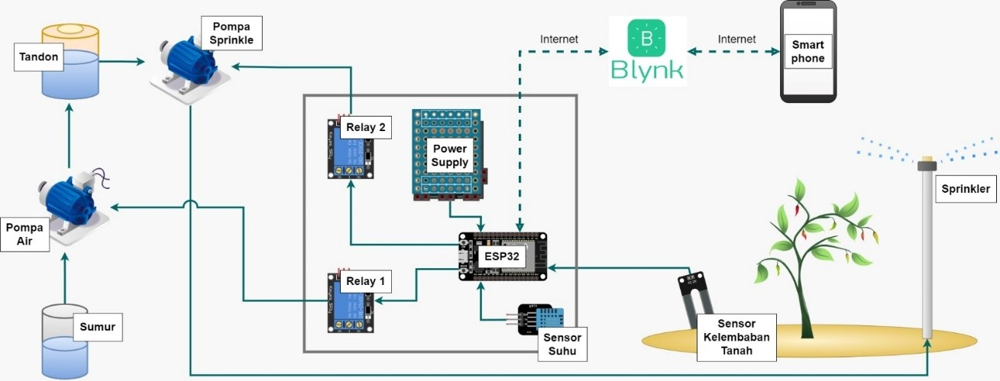
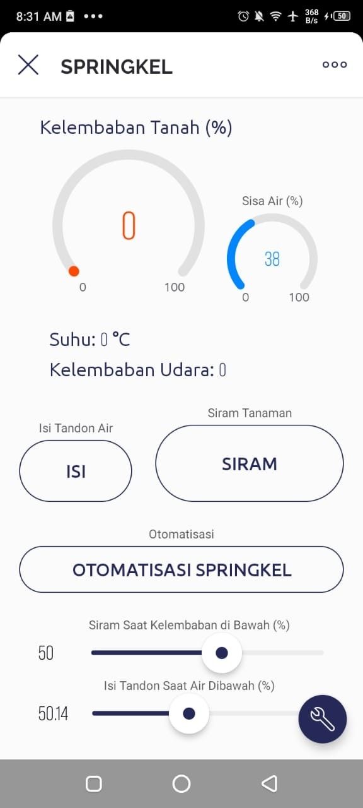

# EcoSprinkle

## Deskripsi:
EcoSprinkle merupakan Aplikasi yang dikembangkan untuk memberikan kontrol dan monitoring yang lebih cerdas dalam penyiraman tanaman pertanian. Aplikasi ini menggunakan berbagai sensor yang dipasang di lahan pertanian untuk mengumpulkan data terkait kondisi lingkungan, seperti tingkat kelembaban tanah, suhu, kelembaban udara, dan sensor ultrasonik untuk mengukur tingkat air yang tersisa dalam tandon penyimpanan air. Data-data yang dikumpulkan oleh sensor-sensor ini digunakan untuk mengambil keputusan. 

Keputusan ini diimplementasikan dalam penyiraman tanaman menggunakan sprinkler dan pengisian air tandon yang dapat dikendalikan secara manual maupun otomatis melalui aplikasi smartphone. Dengan demikian, petani dapat memantau, mengatur, dan mengoptimalkan irigasi mereka dengan lebih efisien, dan diharapkan dapat menghasilkan peningkatan hasil panen dan penghematan sumber daya air.

## Komponen Yang Digunakan:
* Mikrocontroller ESP32
* Sensor Kelembaban Tanah
* Sensor Suhu & Kelembaban Udara (DHT22)
* Sensor Ultrasonik
* Relay 3.3v 2 channel
* Power Supply 5V/5A
* Kabel Jumper
* Breadboard
* Modem Internet
* Smartphone
* Pompa Air 2 Unit
* Stop Kontak
* Kabel Listrik
* Tandon Air
* Sumur Bor
* Pipa & Sambungan Pipa
* Sprinkler

## Aplikasi Pendukung:
* Blynk
* Arduino IDE

## Fitur:
* Login
* Manajemen User
* Monitoring Kelembaban Tanah, Suhu, Kelembaban Udara, Sisa Air dalam Tandon
* Mengontrol Isi Tandon Air & Penyiraman Tanaman
* Otomatisasi Isi Tandon Air & Penyiraman Tanaman

## Rancangan:
 

## Tampilan:

Selengkapnya:
https://youtu.be/nk2Vs6ucmLQ
